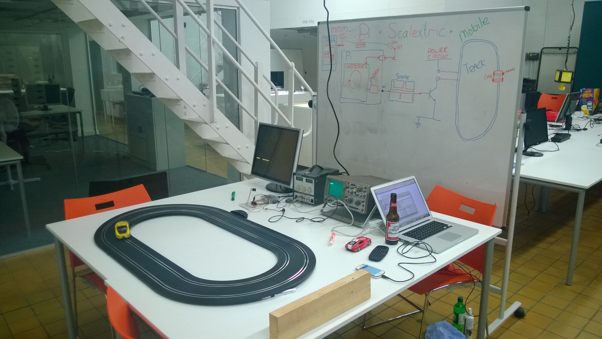
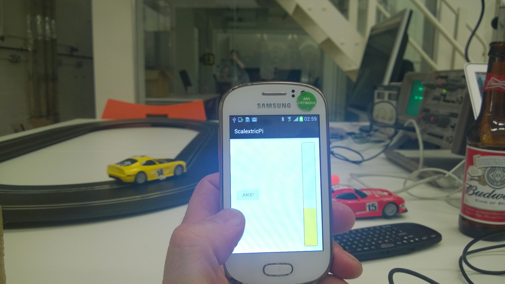

#Mo' Scalextric

**Challenge Rating: 2/5 -> 4/5**

Once, a long time ago people played with toy cars on a track. There were wires. There was a squeezy trigger. You pulled the trigger to make the car go. You squeezed harder to make the car go faster. You raced against one another. And that was it. But it was soooo cool! And it still is now.

A little while ago we wondered if we could make an app to control the cars wirelessly, so you didn't get tangled up in the wires when you went to put the car back on the track. (Actually, we're were dying see what we could do with a Raspberry Pi)

We used a Rasbberry Pi to control a power transistor, via its GPIO pins. This controlled the power put down onto the track, and into the car.
The Raspberry Pi connected to WiFi, and delivered a REST interface, via a tiny web-server.
The Phone was a basic Android device, with a UI of one button that increased the power level the longer you held it down, like an accelerator. 
The phone talked to the web-service, and hey presto! Wireless Scalextric.

It was great! 

But we ran out of time, so, only one car was controlled, and all the fab things we thought of being able to do, we never did.
So now it's your turn.

## What we want
We've done the basics. Now we want to have some fun:

* Easy discovery and connection. (UPnP, or even display the IP address of the Pi on a small display )
* Headerless: Just switch on the Raspberry Pi and connect. No faff.
* 2 cars:  We only supported one in the original
* A better way of controlling the cars
* Weapons! We want to be able to shoot each other OFF THE TRACK
* Sound effects

Constraints:
No more electronics stuff, or modifying the cars, except, maybe putting stickers on them, or light weight add-ons. Any additional behaviour is simply done by using what you have.

Things we learned:
The user experience is just as fun at slow speeds, if there is stuff you can do.

# Experience Areas
**This project will allow members to gain and exercise knowledge and experience in the following areas:**

* Scalextric :-)
* Raspberry Pi
* Raspbian
* Python
* Ionic / Cordova cross-platform mobile (Javascript, Angular, HTML, CSS)
* HTTP / REST
* UI / UX

# Equipment or Accounts needed
* [Scalextric starter pack](http://www.amazon.co.uk/dp/B01CYE2NYK/ref=cm_sw_r_tw_dp_x_pPqXzbKBQ1MS2): £66 at time of writing
* [Spare pick-ups](http://amzn.eu/aTCU0Jz) Pack of 4: £5 at time of writing.
* [Raspberry Pi + power supply etc](http://amzn.eu/dqwQyxr) £48 at time of writing
* Electronics bits from Maplin: £50 
# Possible costs
Total:  around £180